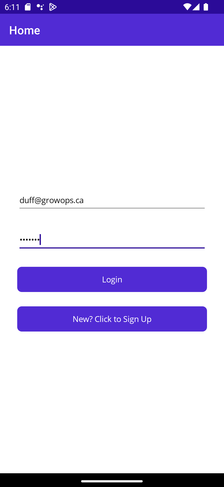
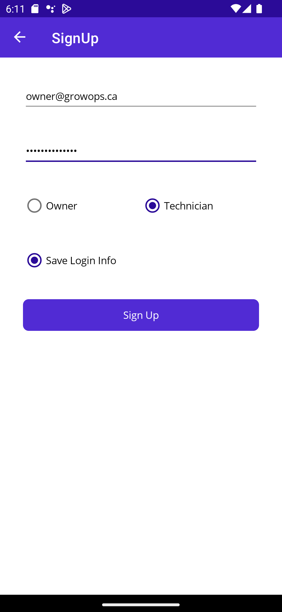

# 
(420-6A6-AB) APP DEV III  (420-6P3-AB) Connected Objects  Winter 2023

## 
Project Documentation

## 
Container-Farms

- [(420-6A6-AB) APP DEV III (420-6P3-AB) Connected Objects Winter 2023]
---

# Team Information
Team Name: GrowOps
Team Letter:

Eric Duffield: 2058974
Samuel Anderson: 1360134
Chase Lipari: 2062353

 
 

# Project Description

Our GrowOps application is for owners and farm technicians to monitor and control multiple aspects of the farm containers. There will be a login page, a couple plant(technician) pages, and a couple geolocation/security(owner)pages as well as a settings page. The system uses a raspberry pi and a reterminal with many sensors and actuators. 

Sensors: Temperature, Humidity, Water Level, Soil Moisture, Gps, Accelerometer, Vibration, Noise, Luminosity, Motion, Door State

Actuators: Buzzer, Door Lock, Led Strip, Fan
 
 

# Credentials

These credentials can be used for testing incase there is an issue with creating an account:

Technician: 
- email: test@growops.ca 
- password: growops

Owner:
- email: testowner@growops.ca 
- password: growops

 
 

# Running the farm
1. Install packages as sudo by running `sudo pip install -r requirements.txt` (make sure you're in the /farm folder)
2. See [GPIO Pins](#gpio-pin-locations) to know where all the sensors and actuators should be installed
3. run `python3 farm.py`
## Packages have been moved to requirements.txt. Packages must be installed as sudo.
 
 

# GPIO Pin locations
### Plant Subsystem
| Hardware  | Gpio |
| ------------- | ------------- |
| Fan  | 16  |
| Led Strip  | 18  |
| Soil Moisture Sensor  | 2  |
| Temperature/Humidity Sensor  | 26  |
| Water Level Sensor  | 6  |

### Security Subsystem
| Hardware  | Gpio |
| ------------- | ------------- |
| Door Lock Actuator | 12 (PWM)  |
| Door State | 24  |
| Luminosity  | Built In  |
| Motion Sensor  | 5  |
| Noise  | 0 and 1 |

### Geo Location Subsystem
| Hardware  | Gpio |
| ------------- | ------------- |
| Accelerometer  | Built In  |
| Buzzer  | Built In  |
| Gps  | UART  |

 
 

# Controlling Actuators

### Door Lock
#### Communication Strategy
Direct Method

#### Explanation
This made the most sense to use, when toggling a switch using a direct method the code will be reusable for all of the different actuators and all we have to do is route it to the actuator with the same command type as the direct method.
Device twin could have also been used to direct methods make more sense when you want to take action.
Based on the microsoft documentation, commands that require immediate confirmation should utilize direct methods.
#### Set Lock State to locked (True)
    az iot hub invoke-device-method --hub-name {iothub_name} --device-id {device_id} --method-name lock --method-payload '{"value": True}'

### Buzzer
#### Communication Strategy
Direct Method

#### Explanation
This made the most sense to use, when toggling a switch using a direct method the code will be reusable for all of the different actuators and all we have to do is route it to the actuator with the same command type as the direct method.
Device twin could have also been used to direct methods make more sense when you want to take action.
Based on the microsoft documentation, commands that require immediate confirmation should utilize direct methods.
#### Set Buzzer State to On (True)
    az iot hub invoke-device-method --hub-name {iothub_name} --device-id {device_id} --method-name buzzer --method-payload '{"value": True}'

### Light
#### Communication Strategy
Direct Method

#### Explanation
This made the most sense to use, when toggling a switch using a direct method the code will be reusable for all of the different actuators and all we have to do is route it to the actuator with the same command type as the direct method.
Device twin could have also been used to direct methods make more sense when you want to take action.
Based on the microsoft documentation, commands that require immediate confirmation should utilize direct methods.
#### Set Light State to On (True)
    az iot hub invoke-device-method --hub-name {iothub_name} --device-id {device_id} --method-name light-pulse --method-payload '{"value": True}'

### Fan
#### Communication Strategy
Direct Method

#### Explanation
This made the most sense to use, when toggling a switch using a direct method the code will be reusable for all of the different actuators and all we have to do is route it to the actuator with the same command type as the direct method.
Device twin could have also been used to direct methods make more sense when you want to take action.
Based on the microsoft documentation, commands that require immediate confirmation should utilize direct methods.
#### Set Fan State to On (True)
    az iot hub invoke-device-method --hub-name {iothub_name} --device-id {device_id} --method-name fan --method-payload '{"value": True}'

### Set Telemetry Interval
#### Communication Strategy
Device Twin desired property
#### Explanation
Long-running commands to put a device into a specific state are preferred to be communicated via the device twin desired properties.
C2D messages are only one way and we don't need immediate confirmation that the command was ran.
#### Set Telemetry Interval to 30 seconds
    az iot hub device-twin update -n {iothub_name} -d {device_id} --desired '{"telemetry_interval": 30}'

 
 

# Mobile App

## App Overview

Our GrowOps application is for owners and farm technicians to monitor and control multiple aspects of the farm containers. 

List of pages

Login Page
Accounts/settings page

There are 2 groups of pages depending on if user is a technician or owner. Each group of pages can be navigated with a tab bar at the bottom.

Technician Pages
- Actuators
- Sensors
- Chart

Owner Pages
- Sensors
- Actuators
- Map

 

## App Setup

Firebase is used for authentication and database. Firebase connection strings can be found in ResourceStrings file and can be obtained on the firebase website.

Google maps is used for the map. The google maps api key is found in the AndroidManifest.xml file and can be obtained with a google maps subscription. 

All iot hub connection strings are found in appsettings.json and can be obtained on azure portal

 

## App Functionality

 

The login page will ask a user for a username and password. It will authenticate the user and bring them to either the owner pages or the technician page depending on their level of permission.

The account/settings page displays the user id and email. It has a theme toggle and a logout button.

 

### Technician Pages

Actuators: Has a toggle for door lock, light and fan actuators. Fan actuator is controlled by a temperature threshold slider.

Sensors: Shows a list of sensors and their corresponding values.

Chart: Has a chart that compares the historical values of temperature and humidity.

 

### Owner Pages

Sensors: Shows a list of sensors and their corresponding values.

Actuators: Has a toggle for buzzer and door lock actuators.

Map: Has a map with current location

 

## App Screenshots

 

## Future work

### Changes
We merged the owner actuators and sensors page.
We also merged the settings and account page so there is no settings cog button.

Added sign up page

### Features and Improvements

Notifications: We were planning on adding notifications when certain thresholds were met but did not have time. These notifications would be for security ex: motion detected, noise detected dangerous pitch and roll angles

Visual Improvements and Theme: while we do have a dark mode, it is not very visually appealing so if we had more time we would have picked a nice colour scheme and spent more time on the front end design.

Chart: The chart is not useful and should have been something like a line chart with timestamps or some other comparison that would be more usefull for technician.

The app sometimes crashes after regaining connection when performing ceratain actions. This is very bad and should not happen.

If the python is not running the app will use the last values that were sent. This is fine but the user is not notified that the values could be old. Either a timestamp should be shows so the user can tell when a value is from, or some sort or warnimg message should be displayed.

The database should not be directly controlled by the application. Ideally we would have a 3rd service separate from the app that would deal with writing to a database.

It would be a good idea to have a connection lost warning.

The app depends on the data service and the data service depends on the app. This is bad and the dataservice should be independant and the app should be able to use it but they shouldn't depend on each other.

 
 

# Contributions

| Python Contributions  | Team Member |
| ------------- | ------------- |
| Plant Subsystem | Chase |
| Geo Subsystem | Eric |
| Security Subsystem | Sam |
| Plant Hardware Classes | Chase |
| Geo Hardware Classes | Eric |
| Security Hardware Classes | Sam |
| farm.py | Eric |
| device_controller.py | Sam |
| connection_manager.py | Sam |
| Everything iothub and messages | Sam |
| python interfaces | Everyone |

| App Contributions  | Team Member |
| ------------- | ------------- |
| Login Page and functionality | Sam |
| Navigation | Sam |
| Accounts Page | Eric |
| Technician Actuators Page | Chase |
| Technician Sensors Page | Chase |
| Technician Chart Page | Eric |
| Owner Sensors Page | Eric and Sam |
| Owner Actuators Page | Sam |
| Map | Eric |
| Temperature Threshold | Eric |
| Database | Sam |
| Light/Dark Themes | Chase |

 
 

# 
Design Document

  - [GrowOps Design Document](#growops-design-document)
    - [Pages](#pages)
      - [Login Page](#login-page)
      - [Plants Page](#plants-page)
      - [Security Page](#security-page)
      - [Geolocation Page](#geolocation-page)
      - [Settings Page](#settings-page)
    - [Features](#features)
  - [Wireframe Diagram](#wireframe-diagram)
  - [Running the farm](#running-the-farm)
  - [Packages have been moved to requirements.txt. Packages must be installed as sudo.](#packages-have-been-moved-to-requirementstxt-packages-must-be-installed-as-sudo)
  - [GPIO Pin locations](#gpio-pin-locations)
    - [Plant Subsystem](#plant-subsystem)
    - [Security Subsystem](#security-subsystem)
    - [Geo Location Subsystem](#geo-location-subsystem)
  - [Controlling Actuators](#controlling-actuators)
    - [Door Lock](#door-lock)
      - [Communication Strategy](#communication-strategy)
      - [Explanation](#explanation)
      - [Set Lock State to locked (True)](#set-lock-state-to-locked-true)
    - [Buzzer](#buzzer)
      - [Communication Strategy](#communication-strategy-1)
      - [Explanation](#explanation-1)
      - [Set Buzzer State to On (True)](#set-buzzer-state-to-on-true)
    - [Light](#light)
      - [Communication Strategy](#communication-strategy-2)
      - [Explanation](#explanation-2)
      - [Set Light State to On (True)](#set-light-state-to-on-true)
    - [Fan](#fan)
      - [Communication Strategy](#communication-strategy-3)
      - [Explanation](#explanation-3)
      - [Set Fan State to On (True)](#set-fan-state-to-on-true)
    - [Set Telemetry Interval](#set-telemetry-interval)
      - [Communication Strategy](#communication-strategy-4)
      - [Explanation](#explanation-4)
      - [Set Telemetry Interval to 30 seconds](#set-telemetry-interval-to-30-seconds)

## GrowOps Design Document

Our GrowOps application is for owners and farm technicians to monitor and control multiple aspects of the farm containers. There will be four main pages, login, plants, geolocation and security as well as a settings page.

### Pages

#### Login Page

The login page will prompt the user to use their credentials to login to the app. Based on the credentials and the roles assigned to that user, they will be navigated to different pages. No other buttons or anything will be available to the users because we want everything to be as secure as possible.

#### Plants Page
If the user is a farm technician they will be brought to this page first and will be their ‘Home Page’. There will be a user interface for temperature, humidity, relative water levels, soil moisture levels. There will also be toggle buttons for the fan state and light state.

#### Security Page

If the user logs in as an owner they will be brought to this page. There will be sensors for security features of the farm containers. These include luminosity levels, motion detection and door state. There will also be toggle buttons for the door lock and for the buzzer to turn on or off the alarm.

#### Geolocation Page

This page is only accessible to the owners and will feature graphs about the location of the storage container to monitor the transportation and placement of containers. Another graph will be of the pitch/roll angles and another graph to read vibration levels. These graphs are to ensure integrity of the farm container. There will also be a toggle for the buzzer here. There will also be a way of displaying the gps location. This is unclear how this will be done at the moment.

#### Settings Page
This page is accessible by either role and features different settings that can be toggled by the user. These include but are not limited to theme and notification settings.

### Features

    1. As the farm technician, I want to know the environmental conditions inside the container in near real-time so that I can make necessary adjustments.

    As a Farm technician, I want to be able to measure Temperature and Humidity inside the container to know if I should turn on or off the fan.
    Sensor measures Temperature and Humidity
    Data is sent to IoT Hub
    UI displays Data on a dashboard
    Priority: Must develop.

    As a Farm technician I want to be able to measure relative water levels of my farm to know if there is water needed.
    Sensors measure relative water levels
    Data is sent via MQTT
    UI displays data
    Priority: Must develop.

    As a farm technician, I want to be able to measure soil moisture levels so I can make changes if necessary.
    Sensor captures soil moisture levels
    Data is sent via MQTT
    UI displays data
    Priority: Must develop.

    As a farm technician I want to read the state of the fan to know if it is on/off.
    Fan state is displayed in UI to know if the fan is operational
    Priority: Must develop.

    As a farm technician I want to be able to read light state to know if I need to change the state.
    UI shows the state of the lights to know if they are on or off.
    Priority: Must develop.

    2. As the farm technician, I need to be able to control the environmental conditions inside the container to make sure that plants are healthy.

    As a farm technician, I want to be control the fans inside the container to change the state from on or off to manage the temperature.
    UI has a dashboard to control the state of the fan in the container. 
    Priority: Must develop.

    As a farm technician, I want to be able to control the state of the lights from on or off to manage the plant growth.
    UI has a dashboard to control the state of the lights.
    Priority: Must develop.

    3. As the fleet investor / owner, I want to know the location and placement of the container farms so that I can track company assets.

    As a fleet owner, I want to read noise levels around the container to see if there are any security concerns.
    Read from the buzzer
    Implement a User Interface
    Priority: Must develop.

    As a fleet owner, I want to be able to see light levels to determine if the lights are on or if someone has breached the container.
    UI for light levels
    Read from sensors and store that info
    Priority: Must develop.

    As a fleet owner, I want to be able to detect if there is any motion detected to see if any unpermitted users are around the container.
    Read from motion sensors and store data
    Have a UI and perhaps notifications when motion is detected
    Priority: Must develop.

    As a fleet owner, I want to be able to see if the door is locked or unlocked to be able to ensure security of the container.
    Read data from the lock sensor
    Implement UI
    Priority: Must develop.

    As a fleet owner I want to be able to remotely lock the door with the push of a button.
    UI button switch to be able to turn it off
    Be able to receive command from the back end and actuate appropriately
    Priority: Must develop.

    As a fleet owner I want to be able to see if the security buzzer is alarming currently to be notified of any incident.
    Have a UI of alarm on or off
    Read from sensor data
    Have a notification to the application
    Priority: Must develop.

    As a fleet owner I want to be able to press a button and activate the buzzer or turn it off so I can control safety.
    Have a UI with a button
    Send data and actuate the buzzer
    Priority: Must develop.

    As a fleet owner I want to be able to see if the door is open or closed at any moment to ensure safety of container.
    UI to see door status
    Read sensor data
    Priority: Must develop.

    4. As the fleet owner, I want to be informed of security issues inside the container farm so that I can mobilise an appropriate response.

    As a fleet investor, I want to see the gps location of the container, so that I can keep track of it's transportation.
    Have a UI that shows the gps location. Also possibly have a graph that displays a comparison of location and temperature depending on requirements.
    Priority: Must develop.

    As a farm technician, I want to be able to read the buzzer state to monitor for transportation issues.
    Have a toggle button in UI that displays state of buzzer.
    Priority: Must develop.

    As a farm technician, I want to be able to control the buzzer state for transportation issues.
    Have a toggle button in UI that allows the user to control the state of the buzzer.
    Priority: Must develop.

    As a farm technician, I want to be able to read pitch and roll angles to monitor transportation.
    Have a graph that displays pitch and roll angles.
    Priority: Must develop.

    As a farm technician, I want to be able to read vibration levels to monitor transportation.
    Have a graph that displays the vibration level.
    Priority: Must develop.

    5. As a user I want the app to be good-looking and user-friendly as well as have extra features that add useful functionality to the app.

    As a user I want a settings page that allows me to view and modify any user settings
    A settings page is created that allows user to control settings.
    Priority: Would like to develop.

    As a user I want the UI to be visually appealing and intuitive so that the app is more user friendly.
    The UI’s color scheme and format is visually appealing and intuitive.
    Priority: Would like to develop.

## Wireframe Diagram

